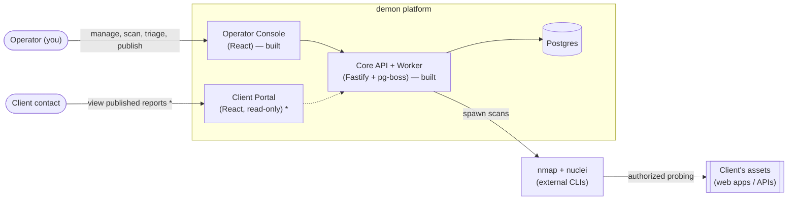
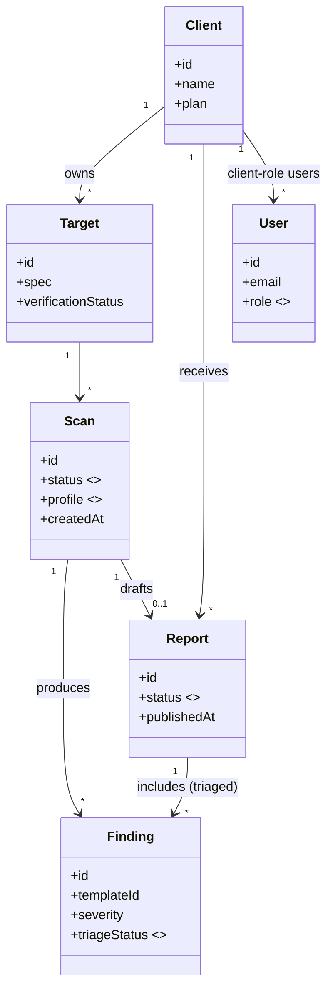
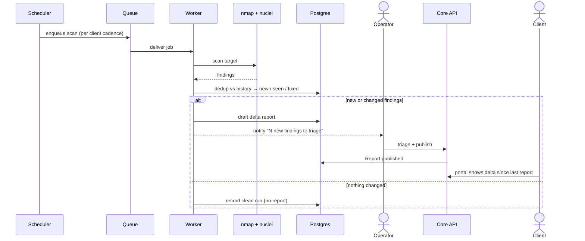
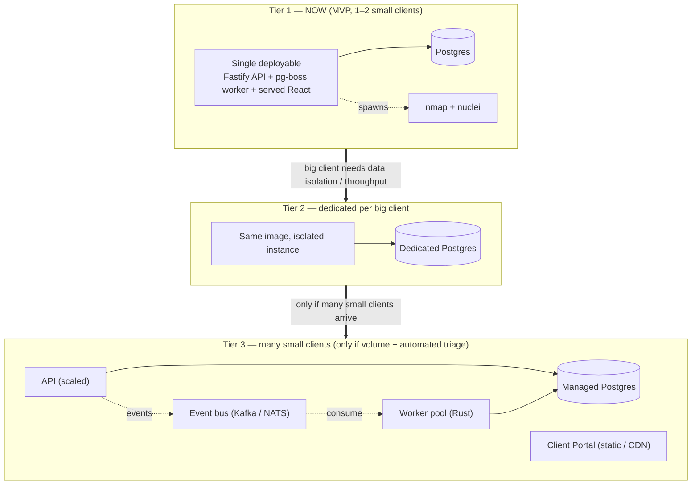

# System Design

_Status: design / direction. Diagrams render on GitHub and in most Markdown
viewers (Mermaid). See `product-and-market.md` for the business context and
`../adr/0001-hexagonal-architecture-and-drizzle.md` for the code architecture._

## Built vs. target — read this first

To avoid confusion, what **exists today** vs what these diagrams **design toward**:

- **Built now:** operator-side scanning spine — `POST /scans` → pg-boss → worker
  (nmap + nuclei) → findings in Postgres → React list with scan profiles + a
  per-severity rollup. Single operator, own targets.
- **Target (designed here, not yet built):** the `Client` entity, the `Report`
  lifecycle + triage, the **client portal**, scheduled/continuous scans, and
  findings dedup/history.

The diagrams show the **target**; nodes that are net-new are called out.

## 1. System context

Who talks to what. (`*` = not yet built.)



## 2. Domain model (UML class)

The ubiquitous language (`../../CONTEXT.md`). `Client`, `Report`, `User`, and
`triageStatus` are the **new** concepts from the product design.



## 3. Sequence — landing a client (one-off assessment)

The end-to-end "land" flow, including the human triage gate.

```mermaid
sequenceDiagram
  actor Op as Operator
  participant API as Core API
  participant Q as Queue (pg-boss)
  participant W as Worker
  participant T as nmap + nuclei
  participant DB as Postgres
  actor Cl as Client

  Op->>API: create Client + Target
  API->>DB: persist (verification_status)
  Op->>API: POST /scans {target, profile}
  API->>Q: enqueue ScanJob
  API-->>Op: 202 queued
  Q->>W: deliver job
  W->>T: nmap discover → nuclei scan
  T-->>W: findings (JSONL)
  W->>DB: store findings, scan = succeeded
  W->>DB: auto-draft Report (status=draft)
  Note over Op,DB: Human triage gate (~30–60 min)
  Op->>API: review; mark false-positive / prioritize
  API->>DB: update Finding.triageStatus
  Op->>API: publish report
  API->>DB: Report status = published
  API-->>Cl: notify (report available)
  Cl->>API: open portal (scoped to their Client)
  API->>DB: read published report + execution metadata
  API-->>Cl: triaged report
```

## 4. Sequence — continuous monitoring cycle

The subscription loop; only surfaces work when something *changes*.



## 5. Deployment tiers & the migration path

The scaling stance: **stay on Tier 1 for the whole 1-2-small + 1-big-client
horizon.** Tiers 2 and 3 are documented so the seams are known — built only when
a real need (isolation demand, or many-small-client volume) arrives.



**Migration seams (already designed into the code — see ADR-0001):**

- **Worker → Rust / worker pool:** reimplement behind the `VulnerabilityScanner`
  port; the web app and domain don't change.
- **pg-boss → event bus:** the worker already emits findings as events; a bus is
  a new adapter behind the `ScanQueue`/publisher port, additive not a rewrite.
- **Per-client isolation:** a `Client` row now; a dedicated instance (same image,
  own DB) for Tier 2 — no multi-tenant machinery until Tier 3.
- **Split single process → API / worker / static frontend:** they're already
  separate adapters wired in one composition root; splitting is a deploy change.

## 6. What this implies for the build order

Next features that move toward this design (each a full grill→spec→build→commit→
blog loop):

1. **Findings dedup + history** (new/seen/fixed) — prerequisite for continuous
   monitoring *and* for cutting triage time. (Already the planned next primary.)
2. **`Client` entity + associating Targets/Scans** — the smallest step toward the
   product model.
3. **`Report` lifecycle + triage UI** in the operator console.
4. **Client portal** (read-only, scoped) + auth roles.
5. **Scheduler** for recurring scans.

Ownership verification (`verification_status`) becomes mandatory at step 4, when
a non-operator first sees data.
